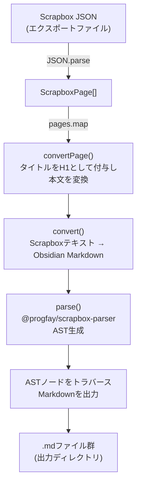

# scrapbox2obsidian

ScrapboxのページをObsidian形式のMarkdownに一括変換するCLIツールです。

## 必要な環境

- Node.js 16以上
- npm

## セットアップ

```sh
git clone <repository-url>
cd migration-from-scrapbox-to-obsidian
npm install
npm run build
```

## 使い方

### 1. ScrapboxからJSONをエクスポートする

1. Scrapboxでエクスポートしたいプロジェクトを開く
2. 右上のメニューから **Settings** → **Export** を選択
3. **Export as JSON** をクリックしてJSONファイルをダウンロードする

### 2. 変換を実行する

```sh
npx scrapbox2obsidian <input.json> <output-dir>
```

- `<input.json>` — ScrapboxからエクスポートしたJSONファイルのパス
- `<output-dir>` — 変換後のMarkdownファイルを出力するディレクトリ（存在しない場合は自動作成）

**例:**

```sh
npx scrapbox2obsidian ~/Downloads/my-project.json ~/obsidian-vault/scrapbox
```

実行すると各ページが `<ページタイトル>.md` として出力ディレクトリに保存されます。

```
Done. Converted 42 pages. 0 errors.
```

## 変換仕様

| Scrapbox記法 | Obsidian Markdown |
| --- | --- |
| `[**** 見出し]` | `# 見出し` (H1) |
| `[*** 見出し]` | `## 見出し` (H2) |
| `[** 見出し]` | `### 見出し` (H3) |
| `[* 見出し]` | `#### 見出し` (H4) |
| `[[太字]]` | `**太字**` |
| `[/ イタリック]` | `*イタリック*` |
| `[- 打ち消し]` | `~~打ち消し~~` |
| `[他のページ]` | `[[他のページ]]` (内部リンク) |
| `[ラベル https://...]` | `[ラベル](https://...)` (外部リンク) |
| `[https://...]` | `https://...` (URLのみ) |
| `#タグ` | `#タグ` |
| `` `コード` `` | `` `コード` `` |
| `> 引用` | `> 引用` |
| `[$ E=mc^2]` | `$E=mc^2$` (数式) |
| インデント (空白1個) | `- リストアイテム` |
| ネストされたインデント | 入れ子のリスト |
| `code:hello.js` ブロック | `````javascript` コードブロック |
| `table:名前` ブロック | Markdownテーブル |

## 開発

### コマンド

```sh
npm run build   # TypeScriptをdist/にコンパイル
npm run watch   # ウォッチモードでインクリメンタルコンパイル
npm test        # Jestでテストをすべて実行
npx jest --testPathPattern=<file>  # 特定のテストファイルのみ実行
```

### ディレクトリ構成

```
src/
  cli.ts         # CLIエントリーポイント
  convert.ts     # Scrapbox構文 → Markdown変換のコアロジック
  convertPage.ts # ページ単位の変換（タイトル + 本文）
  sanitize.ts    # ファイル名のサニタイズ
  types.ts       # ScrapboxエクスポートJSONの型定義
  index.ts       # パーサー出力の実験用スクラッチファイル
__tests__/
  converter.test.ts  # convert関数のJestテスト
```

### アーキテクチャ


