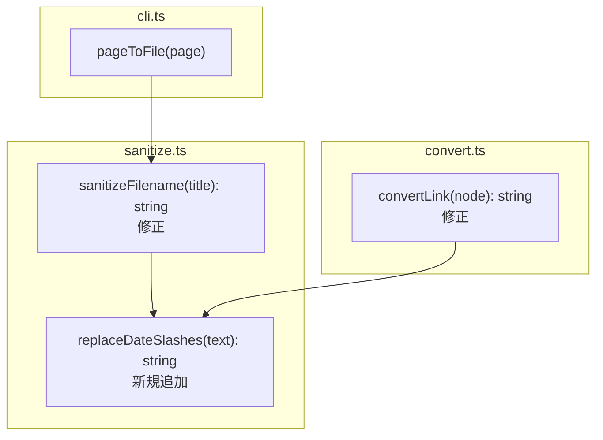
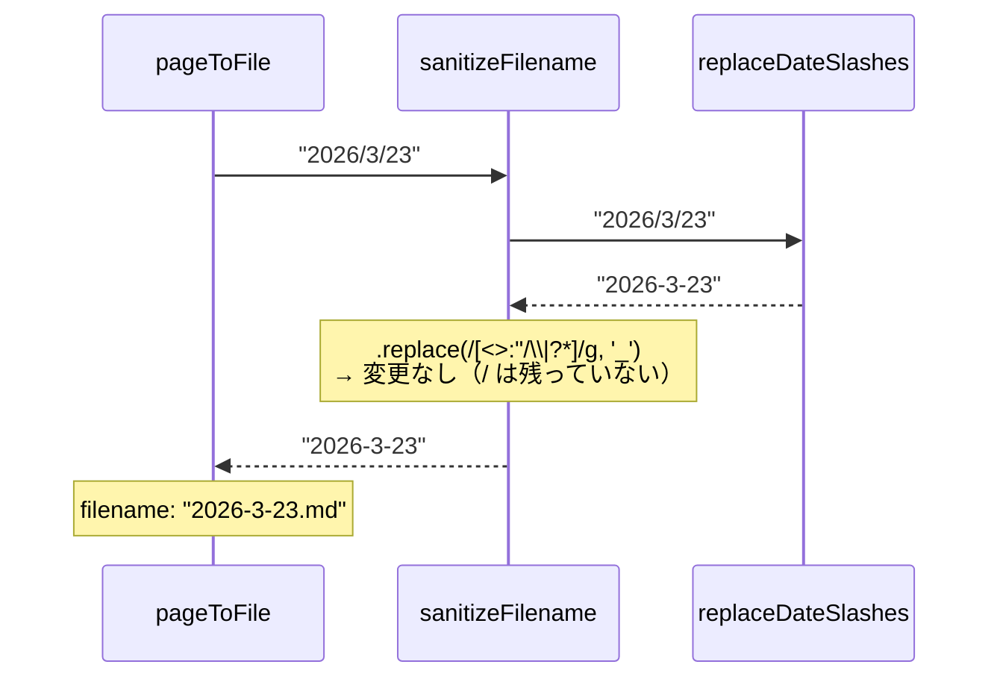
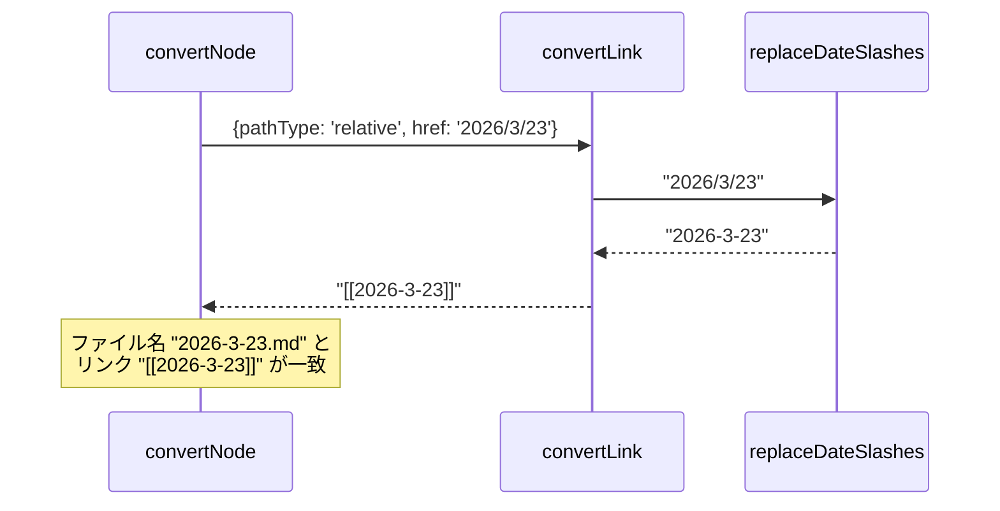
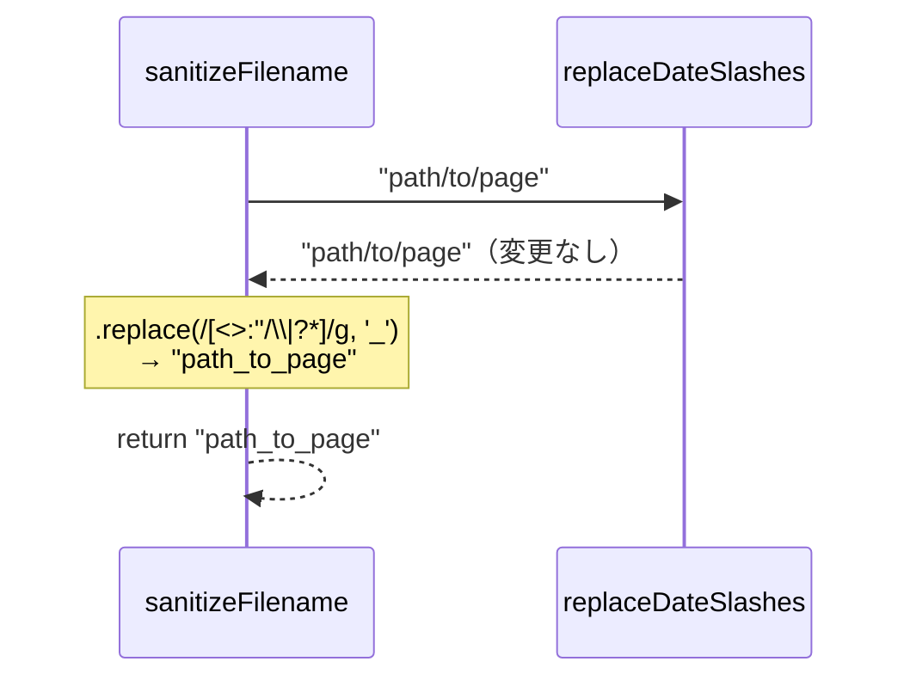

# Design: Date-Aware Slash Replacement

## Architectural Design

既存の変換パイプラインに最小限の変更を加える。日付スラッシュ変換の共通関数 `replaceDateSlashes` を `src/sanitize.ts` に追加し、ファイル名生成とリンク変換の両方から呼び出す。

### 変更対象モジュール

```
src/sanitize.ts  ← replaceDateSlashes 追加、sanitizeFilename 修正
src/convert.ts   ← convertLink で replaceDateSlashes を使用
```

## Component Diagram



## Sequence Diagrams

### ファイル名生成



### 内部リンク変換



### 非日付スラッシュ（既存動作維持）



## Design Decisions

### 正規表現パターン: `/\d{4}\/\d{1,2}\/\d{1,2}/g`

- `YYYY/M/D` と `YYYY/MM/DD` の両方にマッチ
- カレンダー上の妥当性チェック（月が1-12かなど）は行わない。ファイル名変換ツールとしては構文的に日付に見えるものを変換すれば十分
- `g` フラグで文字列中の複数の日付に対応

### `replaceDateSlashes` を一般置換の前に適用する理由

一般置換 (`/[<>:"\/\\|?*]/g` → `_`) を先に実行すると全ての `/` が `_` に変わり、日付パターンの検出ができなくなる。そのため日付変換を先に行う必要がある。
