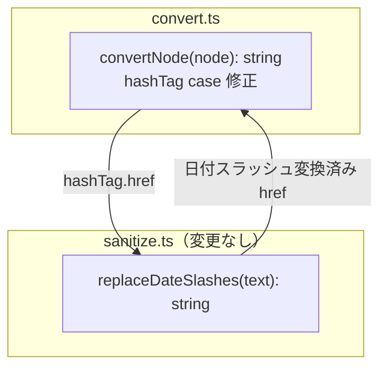
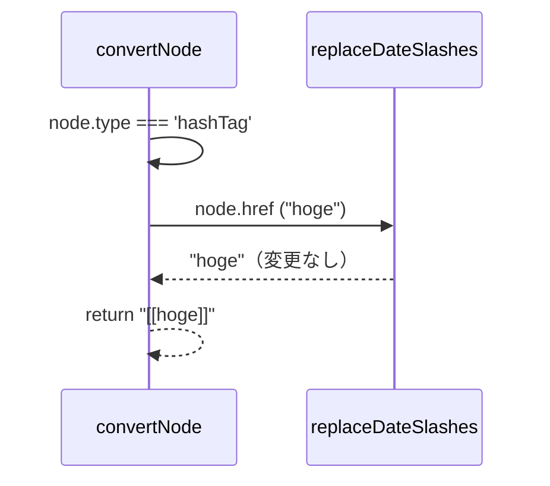
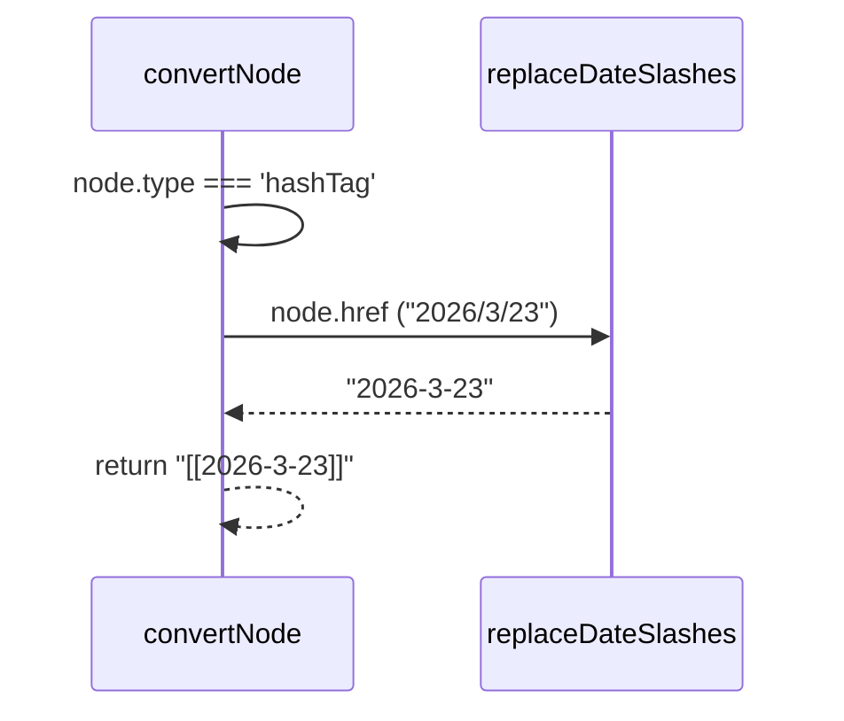

# Design: ハッシュタグを内部リンクに変換

## Architectural Design

既存の変換パイプラインに最小限の変更を加える。`src/convert.ts` の `convertNode` 関数内の `hashTag` case を修正し、`replaceDateSlashes`（既に import 済み）を適用して内部リンク形式で出力する。

### 変更対象モジュール

```
src/convert.ts   ← convertNode の hashTag case を修正
```

新規モジュール・関数の追加は不要。既存の `replaceDateSlashes` を再利用する。

## Component Diagram



## Sequence Diagrams

### ハッシュタグ変換



### 日付形式ハッシュタグ変換



## Design Decisions

### `replaceDateSlashes` を適用する理由

`convertLink` と同様に、ハッシュタグも Obsidian 内部リンクになるため、日付形式のスラッシュをハイフンに変換する必要がある。これにより、ファイル名（`sanitizeFilename` で変換済み）とリンク先が一致することを保証する。

### 新規関数を作成しない理由

変更は `convertNode` 内の 1 行のみ。`replaceDateSlashes` は既に import されており、`convertLink` と同じパターンを踏襲するだけなので、抽象化の追加は不要。
